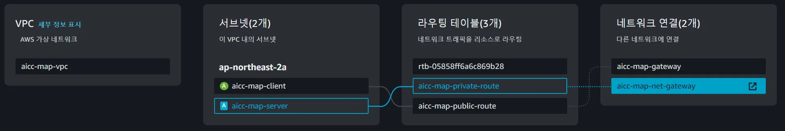
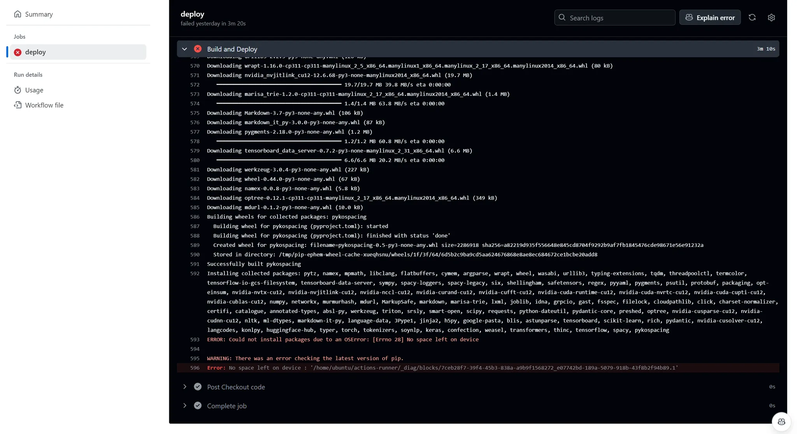

# Server 배포를 위한 Repository 입니다. 

- node.js express로 구성하였습니다. 
- PORT 5000으로 구성하였으며, Client 인스턴스 및 Database 인스턴스와 통신합니다. 

# client 관련 구조도



# AWS VPC Private Subnet
- aicc-map-server로 생성했으며, 10.0.4.0/22로 구성했습니다. 
- 사용 가능한 IP를 1019개 할당해주었습니다.
- server의 경우, 서비스를 사용하는 사용자들이 함부로 접근하지 못해야 하며, 사용하는 서비스의 Client와는 연결되어야 한다 생각했기에 **Private으로 구성하되, 화면인 Client와 데이터가 저장될 Database 인스턴스와는 연결**되도록 구성했습니다. 
- **인터넷이 직접 접근할 수 없는 서브넷**으로 인터넷을 통해 직접 통신하지 않으며, 내부 네트워크용으로 구성하였습니다. 
- 하지만, server 또한 인터넷 사용이 필요한 상황이기에 **NAT 게이트웨이를 통한 간접적 통신**을 구성하였습니다.  

# Routing Table
- VPC 내에서 네트워크 트래픽이 목적지로 어떻게 전달되는지 결정하는 구성요소로, 다음과 같이 구성했습니다. 
- aicc-map-private-route로 생성했으며, Private subnet과 연결되어있습니다.
- 인터넷과 직접 통신하지는 않지만 NAT 게이트 웨이를 통해 외부로 아웃바운드 통신이 가능하도록 구성하였습니다. 

``` 

Destination       Target
0.0.0.0/0         nat-000bc38d9e2bd8b79   (NAT 게이트웨이)
10.0.0.0/16       local                   (VPC 내부 트래픽)

```

# NAT Gateway
- Private subnet이 있기 때문에 구성하였습니다. 
- Private subnet의 인스턴스를 보호합니다. 
- Private subnet의 인스턴스가 인터넷으로 데이터 전송 시, NAT Gateway는 인스턴스의 Private IP 주소를 공인 IP 주소로 변환하여 요청을 보냅니다. 
- 반대로 외부에서 들어오는 응답은 NAT Gateway를 통해 다시 Private IP로 전달되도록 합니다. 
- 아웃바운드 트래픽만을 허용, 외부 트래픽은 기본 차단합니다. 
- 동작 방식은 다음과 같습니다 

```

Priavet Subnet 인스턴스 -> Internet
Internet -> NAT Gateway -> Private Subnet 인스턴스

```

# Server 생성 인스턴스 정보 

| 인스턴스 | 인스턴스 유형 | Public IPv4 | Private IPv4 | 플랫폼 | 키 이름 |
|---------|--------------|-------------|--------------|--------|--------|
|map-server|t2.large|-|10.0.5.201|Linux/UNIX|map-server|

# 문제점 
- Chatbot을 위한 python 가상 환경이 필요했지만, 해당 인스턴스에 남은 **메모리와 공간이 부족**하였습니다. 
- 다른 파일을 정리했지만, 프로젝트의 필요 공간이 너무 큰 탓에 배포가 잘 이루어지지 않았습니다. 
- 아래는 Github Action Runner를 통한 PUSH Trigger로 인한 배포 과정 중 위와 같은 오류로 멈춘 화면입니다. 


